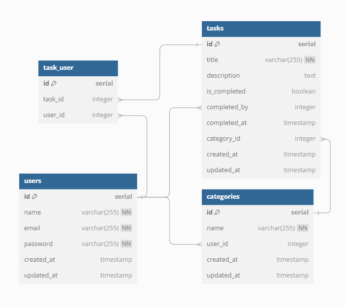
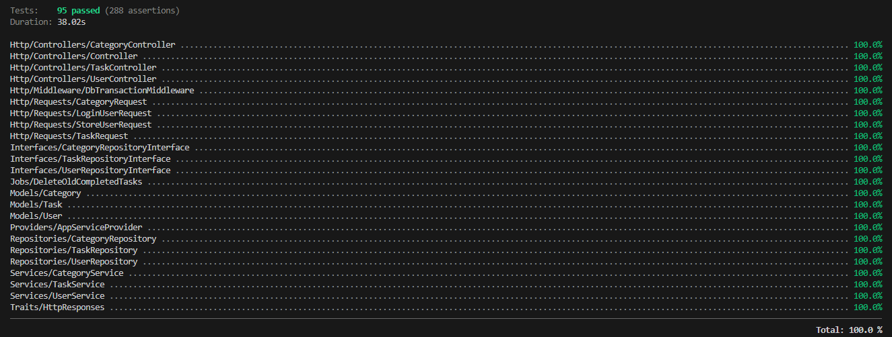

<p align=center>
    
</p>

# Introdução

O PRIORITASK é um sistema simples e eficiente para organizar tarefas e gerenciar seu tempo. Com ele, você pode criar, editar, atualizar e acompanhar suas tarefas, além de separá-las por categorias e marcá-las como concluídas. Tudo para facilitar o dia a dia e ajudar você a manter o foco nas suas prioridades.

## índice

- [Requisitos do sistema](#requisitos-do-sistema)
  - [Tecnologias e técnicas utilizadas](#tecnologias-e-técnicas-utilizadas)
- [Modelagem da base de dados](#modelagem-da-base-de-dados)
- [Setup](#setup)
  - [Setup Docker](#setup-docker)
  - [Setup local](#setup-local)
- [Executando os Testes](#executando-os-testes)
- [Documentação](#documentação-de-rotas-do-frontend)
  - [Documentação de Rotas do Frontend](#documentação-de-rotas-do-frontend)
  - [Documentação da API](#documentação-da-api)
- [Melhorias](#melhorias)

## Requisitos do sistema

-   [PHP 8.1 ou superior](https://www.php.net/downloads)
-   [Composer 2.6.5 ou superior](https://getcomposer.org/download/)
-   [NodeJs v18.16.1](https://nodejs.org/)
-   [npm 9.5.1](https://www.npmjs.com/)

### Tecnologias e técnicas utilizadas

-   **Linguagem:** PHP, JS
-   **Framework:** Laravel 11, Vue.js, Tailwind CSS
-   **Banco de Dados:** MySQL
-   **Testes Unitários:** PHPUnit Laravel
-   **Virtualização:** Docker
-   **IDE:** Vscode

## Modelagem da base de dados

Antes da inicialização, foi elaborada a modelagem do banco de dados utilizando o [dbdiagram.io](https://dbdiagram.io/). A imagem abaixo oferece uma visão geral da estrutura do banco de dados integrado ao sistema.

<p align=center>
    
</p>

## Setup

### Clone o projeto

```bash
git clone https://github.com/CarolineSampaio/to-do-list-laravel
cd "to-do-list-laravel"
code ./ #Abrirá na raiz do projeto no vscode
```

### Setup Docker

Execute o seguinte comando para realizar toda a configuração necessária tanto para o backend quanto para o frontend:

```bash
docker compose up
```

Após a execução do comando, os serviços estarão ativos e prontos para uso. Você poderá acessar a aplicação através da URL abaixo:

Base URL: `http://localhost:8000`

### Comandos relevantes:

```bash
docker compose stop # Para a execução do container
docker compose down # remove o container, redes e volumes
```

## Setup Local

### Configure o Banco de dados

Execute o seguinte comando para criar o arquivo de .env local:
```bash
cp .env.example .env
```
Em seguida, insira as credenciais do banco de dados no arquivo criado.

### Configure o ambiente

Execute o seguinte comando para realizar o setup, que inclui a instalação de dependências, a geração da chave do aplicativo, a execução de migrações, seeder e o build do frontend:

```bash
composer setup
```

Em seguida, execute os comandos para subir os servidores:

```bash
composer serve # laravel
npm run dev # vue dev server
```

Após a execução dos comandos, ambos os servidores estarão ativos e prontos para uso. Você poderá acessar a aplicação através da URL abaixo:

Base URL: `http://localhost:8000`

## Executando os Testes

Se o setup foi feito com Docker, não será necessária nenhuma ação adicional, pois o banco de testes já está configurado. No caso de um setup local, será necessário criar um banco de dados de teste e inserir as credenciais no arquivo .env.testing.

Para rodar os testes no ambiente Docker, execute o comando:

```bash
docker compose exec app php artisan test --env=testing --coverage
```

<p align=center>
    
</p>

Captura de tela do resultado esperado dos testes unitários com relatório de cobertura de código.

Em caso de erros, utilize o seguinte comando para limpar as configurações:

```bash
php artisan config:clear
```

## Documentação de Rotas do Frontend

### 1. **/** - Página de Login

-   **Descrição**: Rota destinada à página de login, onde o usuário pode inserir suas credenciais para acessar a aplicação.

### 2. **/register** - Página de Cadastro

-   **Descrição**: Rota destinada ao cadastro de novos usuários, permitindo o registro de uma conta na aplicação.

### 3. **/home** - Dashboard do Usuário

-   **Descrição**: Página inicial após o login, oferecendo ao usuário um painel com mensagens e dados relacionados às suas categorias e tarefas.

### 4. **/tasks** - Página de Tarefas

-   **Descrição**: Rota onde o usuário pode visualizar, criar, editar e gerenciar o status de suas tarefas.

### 5. **/categories** - Página de Categorias

-   **Descrição**: Página para visualização e gerenciamento das categorias de tarefas, permitindo que o usuário organize suas tarefas por categorias.

## Documentação da API

### Endpoints - Autenticação

#### Cadastro de usuário

Rota pública destinada ao cadastro de um novo usuário.

`POST /api/users`

| Parâmetro  | Tipo     | Descrição                                                                                                                                         |
| ---------- | -------- | ------------------------------------------------------------------------------------------------------------------------------------------------- |
| `name`     | `string` | **Obrigatório, mínimo de 3 caracteres, máximo de 150, deve conter apenas letras e espaços.**                                                      |
| `email`    | `string` | **Obrigatório, deve ser um email válido, único na tabela `users`, máximo de 150 caracteres.**                                                     |
| `password` | `string` | **Obrigatório, mínimo de 6 caracteres, máximo de 25, deve conter pelo menos uma letra maiúscula, um número e um caractere especial (!@#$%^&\*).** |

#### Exemplo de Request

Headers

```http
Accept: application/json
```

Request Body

```json
{
    "name": "Jane Doe",
    "email": "jane.doe@example.com",
    "password": "securePass456@"
}
```

Response

```json
{
    "message": "Usuário cadastrado com sucesso.",
    "status": 201,
    "data": {
        "name": "Jane Doe",
        "email": "jane.doe@example.com",
        "updated_at": "2024-12-20T00:08:49.000000Z",
        "created_at": "2024-12-20T00:08:49.000000Z",
        "id": 1
    }
}
```

| Response Status | Descrição                   |
| --------------- | --------------------------- |
| `201`           | Criado com sucesso          |
| `422`           | Falha na validação de dados |
| `500`           | Erro interno no servidor    |

##

#### Login do usuário

Rota pública destinada ao serviço de login via e-mail e senha.

`POST /api/login`

#### Exemplo de Request

Headers

```http
Accept: application/json
```

Request Body

```json
{
    "email": "jane.doe@example.com",
    "password": "securePass456@"
}
```

Response

```json
{
    "message": "Usuário logado com sucesso.",
    "status": 200,
    "data": {
        "token": "2|NfJgAF0KW4Fa2WIrc8N2kV7PEiqgTDGhA7KujUzr6900da7c"
    }
}
```

| Response Status | Descrição                   |
| --------------- | --------------------------- |
| `200`           | Ok - Sucesso                |
| `422`           | Falha na validação de dados |
| `401`           | Credenciais inválidas       |
| `500`           | Erro interno no servidor    |

##

### Endpoints - Categorias

#### Cadastro de categoria

Rota privada destinada ao cadastro de categoria.

`POST /api/categories`

| Parâmetro | Tipo     | Descrição                                  |
| --------- | -------- | ------------------------------------------ |
| `title`   | `string` | **Obrigatório, máximo de 150 caracteres**. |

#### Exemplo de Request

Headers

```http
Accept: application/json
Auth: Bearer token
```

Request Body

```json
{
    "title": "Urgente"
}
```

Response

```json
{
    "message": "Categoria criada com sucesso",
    "status": 201,
    "data": {
        "title": "urgente",
        "updated_at": "2024-12-20T00:22:18.000000Z", // usado para organizar as tarefas pela data de atualização no front
        "id": 1
    }
}
```

| Response Status | Descrição                   |
| --------------- | --------------------------- |
| `201`           | Criado com sucesso          |
| `401`           | Credenciais inválidas       |
| `422`           | Falha na validação de dados |
| `500`           | Erro interno no servidor    |

##

#### Listagem de categorias

Rota privada destinada a listagem de categorias cadastradas pelo usuário autenticado. As Categorias são organizadas em ordem ascendente de acordo com a data de criação.

`GET /api/categories`

#### Exemplo de Request

Headers

```http
Accept: application/json
Auth: Bearer token
```

Response

```json
{
    "message": "Categorias do usuário listadas com sucesso",
    "status": 200,
    "data": [
        {
            "id": 1,
            "title": "urgente",
            "updated_at": "2024-12-20T00:17:02.000000Z"
        },
        {
            "id": 2,
            "title": "importante",
            "updated_at": "2024-12-20T00:22:18.000000Z" // usado para organizar as tarefas pela data de atualização no front
        }
    ]
}
```

| Response Status | Descrição                |
| --------------- | ------------------------ |
| `200`           | Ok - Sucesso             |
| `401`           | Credenciais inválidas    |
| `500`           | Erro interno no servidor |

##

#### Atualização de categoria

Rota privada destinada à atualização de uma categoria.

`PUT /api/categories/:id`

| Parâmetro | Tipo     | Descrição                                  |
| --------- | -------- | ------------------------------------------ |
| `title`   | `string` | **Obrigatório, máximo de 150 caracteres**. |

#### Exemplo de Request

```http
PUT /api/categories/1
```

Headers

```http
Accept: application/json
Auth: Bearer token
```

Request Body

```json
{
    "title": "Urgente hoje"
}
```

Response

```json
{
    "message": "Categoria atualizada com sucesso",
    "status": 200,
    "data": {
        "id": 1,
        "title": "urgente hoje",
        "updated_at": "2024-12-20T00:29:43.000000Z"
    }
}
```

| Response Status | Descrição                   |
| --------------- | --------------------------- |
| `200`           | Ok - Sucesso                |
| `401`           | Credenciais inválidas       |
| `422`           | Falha na validação de dados |
| `500`           | Erro interno no servidor    |

##

#### Deleção de categoria

Rota privada destinada a deleção de uma categoria.

`DELETE /api/categories/:id`

#### Exemplo de Request

```http
PUT /api/categories/1
```

Headers

```http
Accept: application/json
Auth: Bearer token
```

Response

```
Status 204 No Content
```

| Response Status | Descrição                        |
| --------------- | -------------------------------- |
| `204`           | Sucesso, sem conteúdo a retornar |
| `401`           | Credenciais inválidas            |
| `500`           | Erro interno no servidor         |

##

### Endpoints - Tarefas

#### Cadastro de Tarefas

Rota privada destinada ao cadastro de tarefas.

`POST /api/tasks`

| Parâmetro     | Tipo      | Descrição                                                                                                             |
| ------------- | --------- | --------------------------------------------------------------------------------------------------------------------- |
| `title`       | `string`  | **Obrigatório, máximo de 255 caracteres.**                                                                            |
| `description` | `string`  | **Opcional, sem limite de caracteres.**                                                                               |
| `category_id` | `integer` | **Opcional, deve ser um número inteiro e existir como um `id` válido na tabela `categories` do usuário autenticado.** |

#### Exemplo de Request

Headers

```http
Accept: application/json
Auth: Bearer token
```

Request Body

```json
{
    "title": "Tarefa Um"
}
```

Response

```json
{
    "message": "Tarefa criada com sucesso",
    "status": 201,
    "data": {
        "title": "Tarefa Um",
        "description": null,
        "category_id": null,
        "updated_at": "2024-12-20T00:38:11.000000Z",
        "created_at": "2024-12-20T00:38:11.000000Z",
        "id": 1
    }
}
```

| Response Status | Descrição                   |
| --------------- | --------------------------- |
| `201`           | Criado com sucesso          |
| `401`           | Credenciais inválidas       |
| `422`           | Falha na validação de dados |
| `500`           | Erro interno no servidor    |

##

#### Listagem de tarefas

Rota privada destinada a listagem de tarefas cadastradas pelo usuário autenticado, ou que o usuário tenha sido designado. As tarefas são organizadas em ordem ascendente de acordo com a data de criação.

`GET /api/tasks`

#### Exemplo de Request

Headers

```http
Accept: application/json
Auth: Bearer token
```

Response

```json
{
    "message": "Tarefas listadas com sucesso",
    "status": 200,
    "data": [
        {
            "id": 1,
            "title": "Tarefa Um",
            "description": null,
            "category_id": null,
            "is_completed": false,
            "completed_by": null,
            "completed_at": null,
            "created_at": "2024-12-20T00:38:11.000000Z",
            "updated_at": "2024-12-20T00:38:11.000000Z"
        }
    ]
}
```

| Response Status | Descrição                |
| --------------- | ------------------------ |
| `200`           | Ok - Sucesso             |
| `401`           | Credenciais inválidas    |
| `500`           | Erro interno no servidor |

##

#### Atualização de tarefa

Rota privada destinada à atualização de uma tarefa.

`PUT /api/tasks/:id`

| Parâmetro     | Tipo      | Descrição                                                                                         |
| ------------- | --------- | ------------------------------------------------------------------------------------------------- |
| `title`       | `string`  | **Opcional, máximo de 150 caracteres.**                                                           |
| `description` | `string`  | **Opcional, sem limite de caracteres.**                                                           |
| `category_id` | `integer` | **Opcional, deve ser um número inteiro e existir na tabela `categories` pertencente ao usuário.** |

#### Exemplo de Request

```http
PUT /api/tasks/1
```

Headers

```http
Accept: application/json
Auth: Bearer token
```

Request Body

```json
{
    "title": "Tarefa outro nome",
    "category_id": 1
}
```

Response

```json
{
    "message": "Tarefa atualizada com sucesso",
    "status": 200,
    "data": {
        "id": 1,
        "title": "Tarefa outro nome",
        "description": null,
        "category_id": 1,
        "is_completed": false,
        "completed_by": null,
        "completed_at": null,
        "created_at": "2024-12-20T00:38:11.000000Z",
        "updated_at": "2024-12-20T00:46:36.000000Z"
    }
}
```

| Response Status | Descrição                   |
| --------------- | --------------------------- |
| `200`           | Ok - Sucesso                |
| `401`           | Credenciais inválidas       |
| `422`           | Falha na validação de dados |
| `500`           | Erro interno no servidor    |

##

#### Deleção de tarefa

Rota privada destinada a deleção de uma tarefa.

`DELETE /api/tasks/:id`

#### Exemplo de Request

```http
PUT /api/tasks/1
```

Headers

```http
Accept: application/json
Auth: Bearer token
```

Response

```
Status 204 No Content
```

| Response Status | Descrição                        |
| --------------- | -------------------------------- |
| `204`           | Sucesso, sem conteúdo a retornar |
| `401`           | Credenciais inválidas            |
| `500`           | Erro interno no servidor         |

##

#### Alteração do status de conclusão de uma tarefa

Rota privada destinada à alternância do status de conclusão de uma tarefa.

-   Se o campo `is_completed` estiver `false`, ele será alterado para `true`, e os campos `completed_by` e `completed_at` serão preenchidos com o ID do usuário autenticado e o timestamp atual, respectivamente.  
    <br>
-   Se o campo `is_completed` estiver `true`, ele será alterado para `false`, e os campos `completed_by` e `completed_at` serão definidos como `null`.

<br>

`PATCH /api/tasks/:id/complete`

#### Exemplo de Request

```http
PATCH /api/tasks/1/complete
```

Headers

```http
Accept: application/json
Auth: Bearer token
```

Response

```json
{
    "message": "Tarefa atualizada com sucesso",
    "status": 200,
    "data": {
        "id": 1,
        "title": "Tarefa outro nome",
        "description": null,
        "category_id": 4,
        "is_completed": true,
        "completed_by": {
            "id": 3,
            "name": "Jane Doe" // info utilizada no frontend
        },
        "completed_at": "2024-12-20T01:01:57.393876Z",
        "created_at": "2024-12-20T00:38:11.000000Z",
        "updated_at": "2024-12-20T01:01:57.000000Z"
    }
}
```

| Response Status | Descrição                |
| --------------- | ------------------------ |
| `200`           | Ok - Sucesso             |
| `401`           | Credenciais inválidas    |
| `500`           | Erro interno no servidor |

##

## Melhorias

-   [x] **Implementar testes**: Garantir a qualidade e confiabilidade do sistema por meio de testes automatizados para validação de funcionalidades e integrações entre os módulos.

-   [x] **Deletar Tarefas Automaticamente**: O Job `DeleteOldCompletedTasks` foi implementado para excluir tarefas concluídas automaticamente após uma semana, garantindo a limpeza do banco de dados e melhorando a eficiência do sistema.

-   [x] **Melhoria na gestão de status de tarefas**: Foram adicionados os campos `completed_by`, `completed_at` e `is_completed` para identificar quem completou a tarefa, quando ela foi concluída e se está marcada como concluída, melhorando o controle e acompanhamento das tarefas.

-   [x] **Tratar exceções com o Handler global**: Centralizar o tratamento de exceções no Laravel, evitando redundância de try-catch nos controllers.

-   [ ] **Ajuste no relacionamento de tarefas e categorias**: Identificou-se que o compartilhamento de tarefas entre múltiplos usuários pode gerar inconsistências, pois as categorias são exclusivas de cada usuário. Proposta de revisão para garantir a independência das categorias e o compartilhamento correto das tarefas.

-   [ ] **Adicionar paginação nas listas de tarefas, categorias e usuários**: Melhorar a experiência do usuário e o desempenho do sistema ao exibir grandes volumes de dados.

-   [ ] **Implementar soft delete para exclusão de tarefas concluídas**: Substituir a exclusão permanente pelo soft delete para permitir a recuperação de dados caso necessário.

-   [ ] **Implementar sistema de roles e permissões**: Incorporar níveis de acesso para usuários (ex.: administrador, usuário comum) e proteger funcionalidades sensíveis.

-   [ ] **Implementar notificações para eventos importantes**: Enviar notificações (e-mails ou mensagens no sistema) para alertar usuários sobre tarefas próximas do vencimento ou concluídas.

-   [ ] **Realizar deploy em um servidor de nuvem**: Implementar o deploy da aplicação em uma plataforma de nuvem como AWS ou Heroku para disponibilizá-la em produção.

-   [ ] **Implementar carregamento assíncrono no frontend**: Usar AJAX ou bibliotecas como Axios para tornar o sistema mais dinâmico ao atualizar dados sem recarregar a página.

-   [ ] **Oferecer integração com APIs de terceiros**: Por exemplo, permitir login com Google ou GitHub para facilitar o cadastro e login de usuários.
